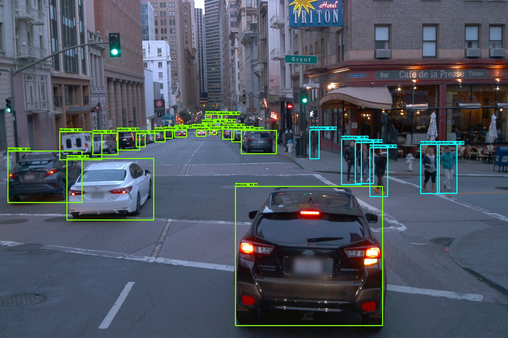
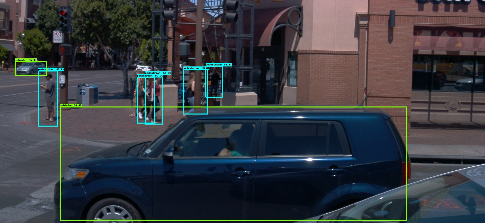
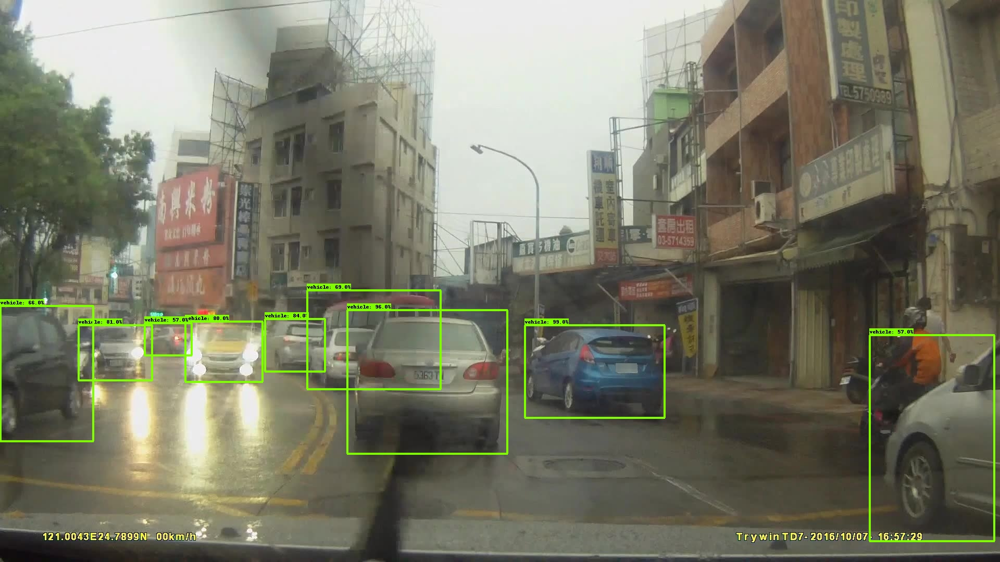
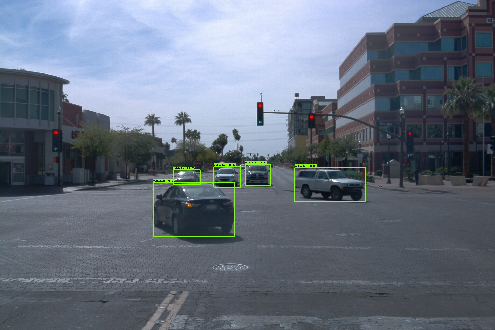

# Waymo-2D-Object-Detection


---

# Introduction
This is a repo using tensorflow object detection API to detect Waymo open dataset. <br/>
Reference: [Tensorflow Docs](https://tensorflow-object-detection-api-tutorial.readthedocs.io/en/latest/training.html)

---

# Requirements

Details are in [the notebook.](./Configurations/Install-object-detection-api-script.ipynb)


---

# Dataset

[Waymo Open Dataset](https://console.cloud.google.com/storage/browser/waymo_open_dataset_v_1_2_0;tab=objects?prefix=&forceOnObjectsSortingFiltering=false)

---

# Label Map
```sh
item {
    id: 1
    name: 'vehicle'
}

item {
    id: 2
    name: 'pedestrian'
}

item {
    id: 4
    name: 'cyclist'
}

```

---
# Preprocess
Filter out lidar informations and leverage bounding boxes of FRONT, FRONT_LEFT, FRONT_RIGHT, SIDE_LEFT, SIDE_RIGHT cameras.

## [Code](./code/create_record_multifiles.py)
## [Script](./Preprocess_script.ipynb)

---

# Train and Evaluate
Fine tune [models](https://github.com/tensorflow/models/blob/master/research/object_detection/g3doc/tf2_detection_zoo.md) pre-trained on COCO dataset.

[Train](./train.ipynb) and [evaluate](./eval.ipynb) at the same time and save the best model checkpoint during training.


---

# Results

## CenterNet
### Taiwan Street


### Waymo Image



## SSD ResNet
### Taiwan Street



### Waymo Image


