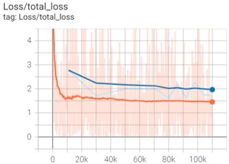
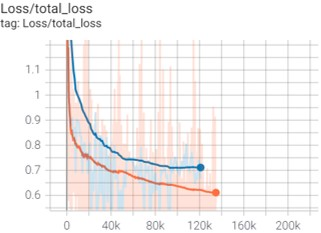
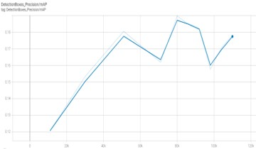
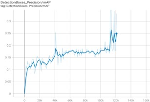
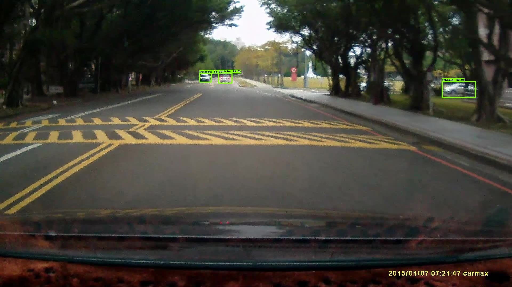
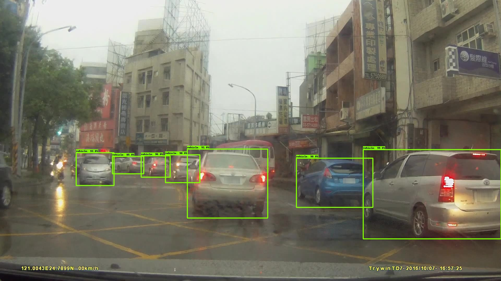
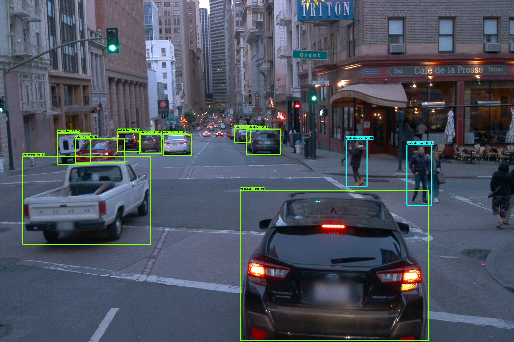

# Waymo-2D-Object-Detection
Using Tensorflow Object Detection API to detect Waymo open dataset

---

# Result

## CenterNet Training Loss

## SSD ResNet Training Loss

## CenterNet mAp

## SSD ResNet mAp

---

# Test Images

## CenterNet
### Taiwan Street

### Waymo Image

## SSD ResNet
### Taiwan Street

### Waymo Image

